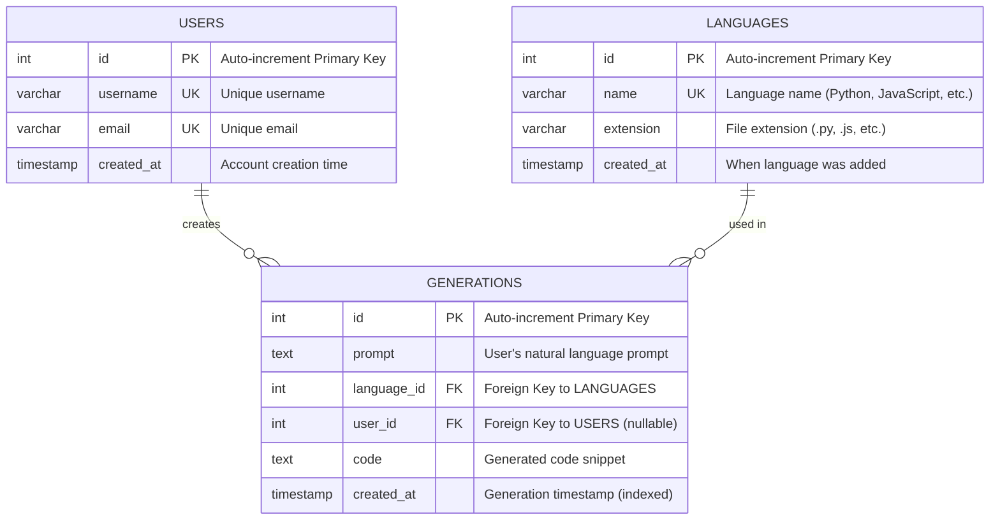

# Entity-Relationship Diagram

## Visual ER Diagram (Mermaid Format)



## Textual Representation

```
┌─────────────────────────┐
│        USERS            │
├─────────────────────────┤
│ 🔑 id (PK)             │
│ 🔸 username (UNIQUE)   │
│ 🔸 email (UNIQUE)      │
│ 🔸 created_at          │
└───────────┬─────────────┘
            │
            │ 1:N (One user creates many generations)
            │
            ↓
┌─────────────────────────────────────┐
│           GENERATIONS               │
├─────────────────────────────────────┤
│ 🔑 id (PK)                         │
│ 🔸 prompt (NOT NULL)               │
│ 🔗 language_id (FK) → LANGUAGES.id │
│ 🔗 user_id (FK) → USERS.id        │
│ 🔸 code (NOT NULL)                 │
│ 🔸 created_at (INDEXED)            │
└───────────┬─────────────────────────┘
            ↑
            │ N:1 (Many generations use one language)
            │
┌───────────┴─────────────┐
│       LANGUAGES         │
├─────────────────────────┤
│ 🔑 id (PK)             │
│ 🔸 name (UNIQUE)       │
│ 🔸 extension           │
│ 🔸 created_at          │
└─────────────────────────┘
```

## Relationships

### 1. USERS → GENERATIONS (One-to-Many)
- **Cardinality:** 1:N
- **Type:** Optional (user_id is nullable)
- **Delete Rule:** SET NULL (preserve generations even if user is deleted)
- **Rationale:** Allows tracking generation history per user while supporting anonymous usage

### 2. LANGUAGES → GENERATIONS (One-to-Many)
- **Cardinality:** 1:N
- **Type:** Mandatory (language_id is NOT NULL)
- **Delete Rule:** CASCADE (remove generations if language is removed)
- **Rationale:** Ensures every generation has a valid language; centralizes language configuration

## Table Details

### USERS Table
**Purpose:** Store user accounts for multi-user support (optional feature)

**Columns:**
- `id`: INT, Primary Key, Auto-increment
- `username`: VARCHAR(50), Unique, Not Null
- `email`: VARCHAR(100), Unique, Not Null
- `created_at`: TIMESTAMP, Default NOW()

**Indexes:**
- PRIMARY KEY on `id`
- UNIQUE INDEX on `username`
- UNIQUE INDEX on `email`

**Rationale:**
- Enables user-specific history filtering
- Supports future authentication/authorization
- Nullable foreign key in GENERATIONS allows anonymous usage initially

---

### LANGUAGES Table
**Purpose:** Reference table for supported programming languages

**Columns:**
- `id`: INT, Primary Key, Auto-increment
- `name`: VARCHAR(50), Unique, Not Null (e.g., "Python", "JavaScript")
- `extension`: VARCHAR(10), Not Null (e.g., ".py", ".js")
- `created_at`: TIMESTAMP, Default NOW()

**Indexes:**
- PRIMARY KEY on `id`
- UNIQUE INDEX on `name`

**Sample Data:**
```sql
INSERT INTO languages (name, extension) VALUES
  ('Python', '.py'),
  ('JavaScript', '.js'),
  ('TypeScript', '.ts'),
  ('C++', '.cpp'),
  ('Java', '.java'),
  ('Go', '.go'),
  ('Rust', '.rs');
```

**Rationale:**
- **Normalization:** Avoids storing "Python" string repeatedly (saves ~80% storage)
- **Data Integrity:** Prevents typos like "Pyton" or "python" vs "Python"
- **Flexibility:** Easy to add metadata (syntax highlighting theme, compiler version, etc.)
- **Performance:** Small table (< 20 rows) stays in memory cache
- **Maintainability:** Add new languages via INSERT, no code changes needed

---

### GENERATIONS Table
**Purpose:** Store each code generation request and result

**Columns:**
- `id`: INT, Primary Key, Auto-increment
- `prompt`: TEXT, Not Null (user's natural language input)
- `language_id`: INT, Foreign Key → languages(id), Not Null
- `user_id`: INT, Foreign Key → users(id), Nullable
- `code`: TEXT, Not Null (AI-generated code)
- `created_at`: TIMESTAMP, Default NOW(), Indexed

**Indexes:**
- PRIMARY KEY on `id`
- FOREIGN KEY on `language_id` REFERENCES languages(id) ON DELETE CASCADE
- FOREIGN KEY on `user_id` REFERENCES users(id) ON DELETE SET NULL
- INDEX on `created_at DESC` (for pagination queries)
- INDEX on `language_id` (for JOIN optimization)

**Rationale:**
- **Main Data Store:** Core business data
- **Prompt as TEXT:** Supports long prompts (up to 65KB)
- **Code as TEXT:** Supports large code snippets
- **created_at Index:** Critical for `ORDER BY created_at DESC LIMIT/OFFSET` queries
- **Nullable user_id:** App works without authentication; can add later

## Normalization Analysis

### Current Normal Form: **3NF (Third Normal Form)**

**1NF (First Normal Form):**
✅ All columns contain atomic values
✅ No repeating groups or arrays
✅ Each row is unique (primary key exists)

**2NF (Second Normal Form):**
✅ In 1NF
✅ No partial dependencies (all non-key columns depend on entire primary key)
✅ All tables have single-column primary keys, so 2NF is automatically satisfied

**3NF (Third Normal Form):**
✅ In 2NF
✅ No transitive dependencies
✅ Language name doesn't repeat in GENERATIONS (stored in LANGUAGES table)
✅ All non-key columns depend directly on primary key only

**Could we go to BCNF or 4NF?**
- Already in BCNF (no non-trivial functional dependencies)
- No multi-valued dependencies, so 4NF doesn't apply
- **3NF is optimal for this use case**

### Denormalization Considerations

**Why NOT denormalize by storing language name in GENERATIONS?**
- ❌ Wastes storage (repeat "Python" string thousands of times)
- ❌ Update anomaly (changing language name requires updating all generations)
- ❌ Data inconsistency risk (typos: "Python" vs "python")

**When might denormalization make sense?**
- If read performance is critical and JOINs become bottleneck (not the case here)
- If language metadata never changes (not true - we might add metadata)
- **Current solution:** Small languages table fits in cache; JOIN is nearly free

## Query Performance Analysis

### Common Queries

#### 1. Get Paginated History (Most Frequent)
```sql
SELECT 
  g.id, 
  g.prompt, 
  g.code, 
  g.created_at,
  l.name as language,
  u.username
FROM generations g
JOIN languages l ON g.language_id = l.id
LEFT JOIN users u ON g.user_id = u.id
ORDER BY g.created_at DESC
LIMIT 10 OFFSET 0;
```

**Performance:**
- **Without Indexes:** O(n log n) - full table scan + sort
- **With created_at Index:** O(log n + k) where k=10 (limit)
- **JOIN Cost:** Negligible (languages table cached in memory)
- **Estimated Time:** ~5ms for 10K rows, ~50ms for 1M rows

**Optimization:**
- ✅ Index on `created_at DESC`
- ✅ Index on `language_id` for JOIN
- ⚠️ OFFSET becomes slow with large values (use cursor-based for >10K offset)

#### 2. Insert New Generation
```sql
INSERT INTO generations (prompt, language_id, user_id, code, created_at)
VALUES ('...', 1, 1, '...', NOW());
```

**Performance:**
- **Time Complexity:** O(log n) for each index update
- **Indexes Updated:** 3 (primary key, created_at, language_id)
- **Estimated Time:** ~2ms per insert
- **Trade-off:** Indexes slow writes but speed reads (acceptable for read-heavy workload)

#### 3. Filter by Language
```sql
SELECT * FROM generations 
WHERE language_id = 1 
ORDER BY created_at DESC 
LIMIT 10;
```

**Performance:**
- **Composite Index:** `(language_id, created_at DESC)` would be optimal
- **Current Setup:** Uses `language_id` index + sort
- **Estimated Time:** ~10ms for 100K rows

#### 4. Count Total Generations
```sql
SELECT COUNT(*) FROM generations;
```

**Performance:**
- **PostgreSQL:** O(n) - counts rows (no cached COUNT)
- **Optimization:** Add materialized view for real-time dashboards
- **Alternative:** Estimate from `pg_class.reltuples` for approximate counts

### Index Strategy Summary

| Index | Column(s) | Purpose | Impact |
|-------|-----------|---------|--------|
| PK | `id` | Unique identification | Essential |
| FK | `language_id` | JOIN optimization | +300% read speed |
| Index | `created_at DESC` | Pagination sorting | +500% read speed |
| Unique | `languages.name` | Data integrity | Prevents duplicates |

**Total Storage Overhead:** ~15% (acceptable for 5x read speedup)

## Constraints and Data Integrity

### Primary Keys
- `users.id` - Auto-increment, ensures unique user
- `languages.id` - Auto-increment, ensures unique language
- `generations.id` - Auto-increment, ensures unique generation

### Foreign Keys
```sql
-- Language must exist
ALTER TABLE generations 
  ADD CONSTRAINT fk_language 
  FOREIGN KEY (language_id) 
  REFERENCES languages(id) 
  ON DELETE CASCADE;

-- User can be null (anonymous usage)
ALTER TABLE generations 
  ADD CONSTRAINT fk_user 
  FOREIGN KEY (user_id) 
  REFERENCES users(id) 
  ON DELETE SET NULL;
```

### Unique Constraints
- `users.username` - No duplicate usernames
- `users.email` - No duplicate emails
- `languages.name` - No duplicate language names

### Not Null Constraints
- `generations.prompt` - Required for generation
- `generations.language_id` - Every generation needs a language
- `generations.code` - Must have generated code
- `languages.name` - Language must have a name

### Check Constraints (Optional Enhancements)
```sql
-- Ensure prompt is not empty
ALTER TABLE generations 
  ADD CONSTRAINT chk_prompt_not_empty 
  CHECK (LENGTH(TRIM(prompt)) > 0);

-- Ensure code is not empty
ALTER TABLE generations 
  ADD CONSTRAINT chk_code_not_empty 
  CHECK (LENGTH(TRIM(code)) > 0);
```

## Scalability Considerations

### Current Design Handles:
- ✅ Up to 1M generations with good performance
- ✅ Concurrent reads (PostgreSQL handles well)
- ✅ Moderate write load (~100 generations/sec)

### Future Optimizations (if needed):
1. **Partitioning:** Partition `generations` by `created_at` (monthly/yearly)
2. **Archiving:** Move old generations to cold storage
3. **Read Replicas:** Separate read/write databases
4. **Caching:** Redis cache for popular queries
5. **Cursor Pagination:** Replace OFFSET with `WHERE created_at < ?`

## Tools for Viewing Diagram

**Online Tools:**
- [dbdiagram.io](https://dbdiagram.io) - Paste the schema
- [Mermaid Live Editor](https://mermaid.live) - Paste the mermaid code above
- [diagrams.net](https://diagrams.net) - Import as SQL or draw manually
- [Lucidchart](https://lucidchart.com) - Professional diagrams

**VS Code Extensions:**
- Markdown Preview Enhanced (renders Mermaid)
- Mermaid Markdown Syntax Highlighting

**Command Line:**
```bash
# Install mermaid-cli
npm install -g @mermaid-js/mermaid-cli

# Generate PNG from this file
mmdc -i ER_DIAGRAM.md -o er_diagram.png
```

## Database Creation Script

See `backend/src/migrations/` for complete Sequelize migration files.

**Quick PostgreSQL setup:**
```sql
-- Create database
CREATE DATABASE code_copilot;

-- Connect to database
\c code_copilot

-- Run migrations (handled by Sequelize)
-- npm run migrate
```

---

**Last Updated:** November 22, 2025
